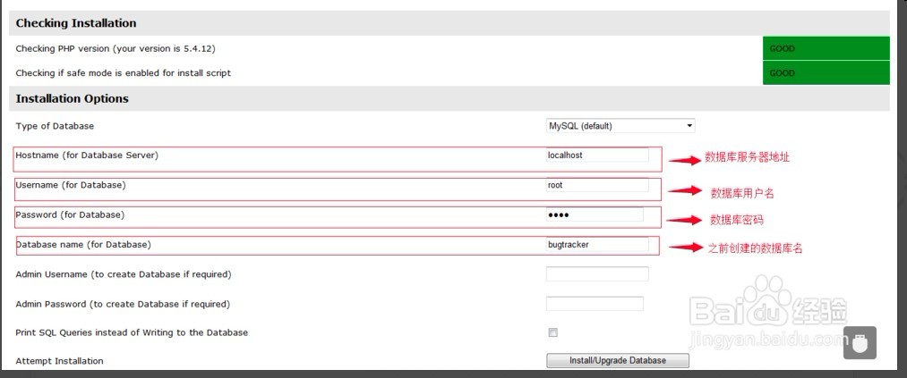

## 一、安装依赖的软件
mantisbt 这个开源的bug管理平台是基于PHP的，推荐运行在apache服务环境下，
数据库使用的是Mysql。

### 需要安装的软件如下：
	1. apache 服务器
	2. PHP 语言解释器
	3. Mysql 数据库软件
	4. php和mysql的接口库
	5. apache 和 PHP 的关联库

### Ubuntu上安装命令如下：

```
sudo apt-get install apache2
sudo apt-get install  php7.0
sudo apt-get install  libapache2-mod-php7.0
sudo apt-get install mysql-server
sudo apt-get install php5-mysql
```

### 测试上面的软件是否运行正常
1. apache 测试
直接用浏览器访问，本机的IP，应该会出现apache 的经典欢迎页面

2. PHP 环境验证
在/var/www/html/目录新建一个名为test.php的文件，然后在文件中加入以下内容，
	```
	<!DOCTYPE html>
	<html>
	<body>

	<?php
	echo "我的第一段 PHP 脚本！";
	?>

	</body>
	</html>

	```
	然后在浏览器上访问这个脚本对应的地址，例如在本机上对应的URL就是：
	http://127.0.0.1/test.php , 如果PHP环境正常的话应该显示一个正常的页面，
	这个页面上显示的是"我的第一段 PHP 脚本！"这句话。

3. mysql 数据库的测试

	输入下面命令看看能否连接上，同时你可以安装一个phpmyadmin
	来提供Mysql的可视化操作。

	```
	mysql -u root -p
	```

4. 关于PHP-mysql的接口测试

	建议安装一个phpmyadmin,具体安装方法如下：

	```
	sudo apt-get install phpmyadmin
	sudo ln -s /usr/share/phpmyadmin /var/www/html/phpmyadmin

	```
	然后访问 http://127.0.0.1/phpmyadmin, 看看是否跳出mysql的管理页面。


## 二、安装配置 mantisbt 基本参数

### 安装 mantisbt
1. 下载mantisbt 安装包,
官方[下载链接](https://jaist.dl.sourceforge.net/project/mantisbt/mantis-stable/2.14.0/mantisbt-2.14.0.zip),
我这边也上传了一份到百度云，[百度网盘下载请点击](https://pan.baidu.com/s/1xsL5_HUdNxBTlvo3E-5EBQ)。
2. 解压mantisbt压缩包到 /var/www/html/ 目录下
3. 在MYSQL中创建一个名字为bugtracker的数据库
4. 在浏览器中输入 http://127.0.0.1/mantisbt/admin/install.php , 然后填入相关的信息即可，具体内容见下图
5. 上面install过程中会设置/var/www/html/mantisbt/config 目录下的config_inc.php 文件。如果你自己重新创建了，mysql的用户，
将bugtracker 这数据库的全部权限授予这个帐号，你就可以修改这个配置文件中的
g_db_username和g_db_password 的值。
6. 登录默认用户，用户名是administrator, 默认密码是 root

### 关闭邮箱注册设置
修改 /var/www/html/mantisbt/ 目录下的config_defaults_inc.php文件，
```
$g_allow_signup         = OFF;
$g_send_reset_password  = OFF;
$g_enable_email_notification = OFF;
```
关闭邮箱提示的原因是，当用的人多的时候，且里面数据存量比较大的时候，
因为发送邮件比较慢，会导致提交一个bug等很久。

### 中文环境配置
修改mantis配置文件：/var/www/html/mantist/config_defaults_inc.php
```
$g_default_language = 'chinese_simplified'
```

### Email 配置

```
$g_use_phpMailer        = ON;
$g_phpMailer_method             = PHPMAILER_METHOD_SMTP; #PHPMAILER_METHOD_MAIL; # or PHPMAILER_METHOD_SMTP, PHPMAILER_METHOD_SENDMAIL
$g_smtp_host                    = 'smtp.demo.cn';                       # used with PHPMAILER_METHOD_SMTP
$g_smtp_username                = 'abc@demo.cn';                                        # used with PHPMAILER_METHOD_SMTP
$g_smtp_password                = '123';                                       # used with PHPMAILER_METHOD_SMTP
$g_administrator_email  = 'abc@demo.cn';
$g_webmaster_email      = 'abc@demo.cn';
$g_from_name                    = 'Mantis Bug Tracker';
$g_from_email           = 'abc@demo.cn';        # the "From: " field in emails
$g_return_path_email    = 'abc@demo.cn';        # the return address for bounced mail
$g_email_receive_own    = OFF;
$g_email_send_using_cronjob = OFF;
```

### 上传文件设置与存放路径

	修改config_inc.php，增加：
	$g_allow_file_upload   = ON;
	$g_file_upload_method = DISK;
	$g_preview_attachments_inline_max_size = 5 * 1024 * 1024; #5M
	$g_max_file_size                = 10 * 1024 * 1024;      # in bytes


## 三、小结及注意点
至此，mantisbt （bug）管理系统就搭建完毕。
如果你关闭了邮箱注册，
此时你就需要用管理员帐号登录，然后在用户管理页面中去创建各个用户，
这种方式比较适合小公司使用，如果是大公司，还是建议打开邮箱注册功能。

#### 注意点：
这个系统在很多时候，会优先使用本地缓存，所以在遇到无法登录或
者服务器上的修改不能在浏览器端及时得到展示，需要考虑清除浏览器的本地缓存。


